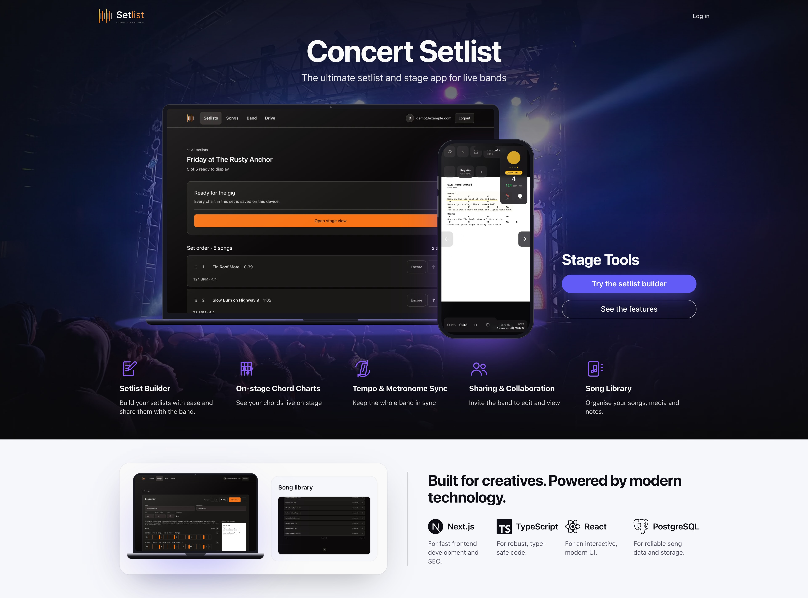
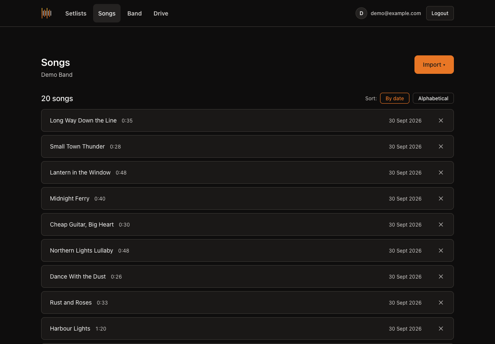
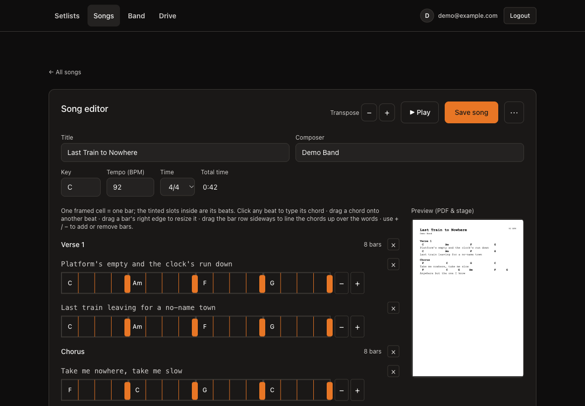
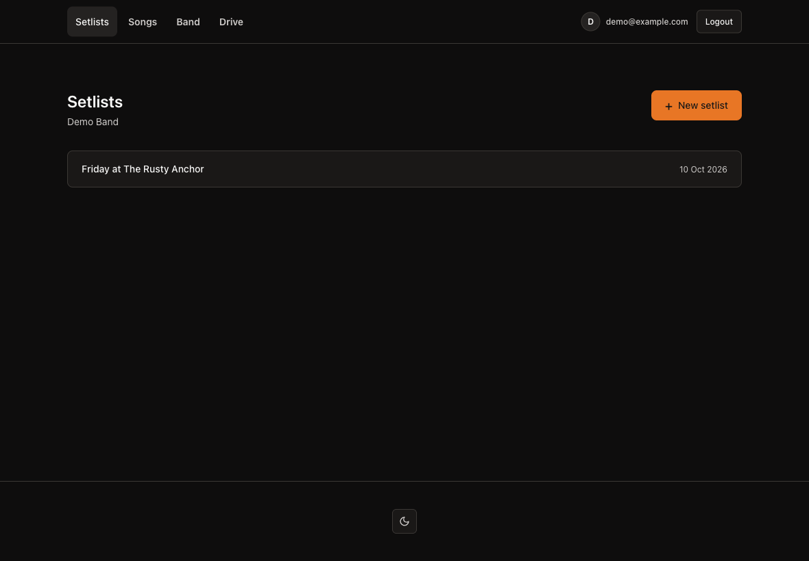
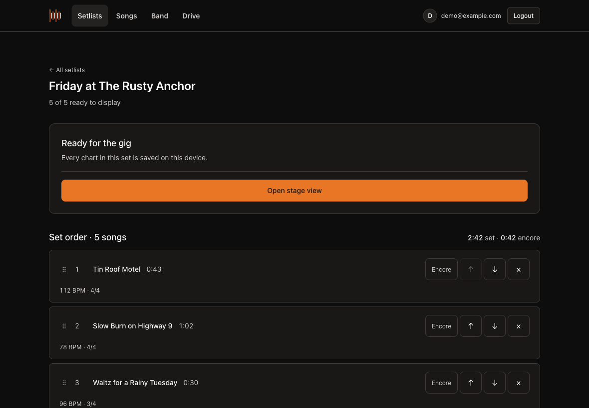
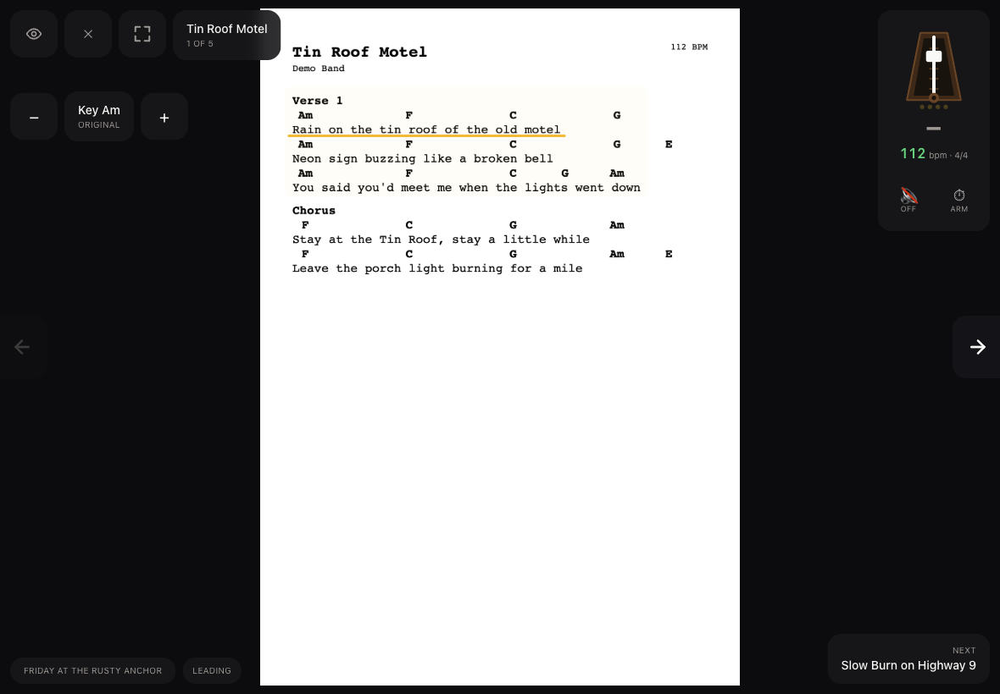

<p align="center">
  <picture>
    <source media="(prefers-color-scheme: dark)" srcset="docs/setlist-logo-dark.svg">
    
  </picture>
</p>

# concert-setlist



A live-performance song viewer for a working band. Songs come from Google Drive; the band reads them on stage, moves between them together, and plays to a shared metronome.

Built for **Murphys Outlaws**, and shaped by that: every decision assumes a dark room, a phone on a mic stand, and no chance to fix anything mid-song.

**Live:** https://concert-setlist.insforge.site

## Landing page

Signed-out visitors land on a public landing page (`src/components/landing/`), in English: the headline *Concert Setlist*, a laptop (the setlist) and a phone (the stage view at 124 BPM with a count-in and the marked lyric line) showing **real dark-mode screenshots** of the app over a concert photo, a *Stage Tools* block with **Try the setlist builder** and **See the features**, five features with a line each — *Setlist Builder*, *On-stage Chord Charts*, *Tempo & Metronome Sync*, *Sharing & Collaboration*, *Song Library* (offline is deliberately not advertised: the stage page itself is not cached, only the charts) — and a light band underneath: a second look at the app (song editor and song library) beside *Built for creatives. Powered by modern technology.* with Next.js, TypeScript, React and PostgreSQL and why each. It uses its own **landing** colour tokens (`--landing-*`: an always-dark hero with an indigo accent over a light band) and is responsive down to a phone. The backdrop photo is `public/landing/stage.jpg` — swap the file to change the mood (credit in `public/landing/CREDITS.md`). Signed-in members skip it and go straight to their setlists. The image at the top of this README is a 4K render of this page. Backdrop photo: *Photo of Band Performing to Crowd of People at a Concert* by [Andre Moura](https://www.pexels.com/@oandremoura/), via Pexels (free licence).

## Screenshots

All shots are iPad landscape, dark mode, and show a fictional demo band — 20 invented songs across 10 setlists, no real charts. Regenerate them with `scripts/seed-demo.mjs` and `scripts/capture-showcase.mjs`.

| | |
|---|---|
|  |  |
|  |  |
|  |  |

**Changing the key on stage.** The bottom row is one song before and after the leader taps `+` twice: `Am F C G` becomes `Hm G D A` (Danish spelling — `H` is B natural) on every device in the band, and the readout follows (*Key Am · Original* → *Key Hm · +2*). The chords are redrawn over the page image exactly where the originals sit; nothing in the song itself changes.

The logo (light and dark) is generated by `scripts/generate-logo.mjs`: eight bars for the eight beats of two bars of 4/4, beat 1 tallest. It sits in the app header and on the sign-in screens, and the favicon and home-screen icons come from the same mark.

---

## What it does

### Getting songs in

One **Import** menu on the songs page, three ways in:

- **Google Drive** — pick **PDFs, images (PNG/JPEG/HEIC), or Google Docs**. The page scrolls to the top first, because Google's picker opens there. Text PDFs have their text extracted *with coordinates*, so the app knows where every line sits. A scan, an image-in-PDF, a Drive image, or a Google Doc (exported to PDF first) that has no text layer is **read by a vision model** and typeset into a real, editable chart. **A scanned PDF is read page by page**, so a two-page chart keeps its second page; if any page fails the read is dropped rather than saving a chart that stops halfway.
- **Photo from the device** — a phone snap or scan (HEIC/PNG/JPEG); the AI reads it into a chart you check in a review card before saving. The photo itself is not kept.
- **Reads the structure off the chart** — sections, their labels, and the tempo markings written between them. Headings can be two words (`Jam Intro`) or name a player (`Solo drums`).
- **Understands Danish headings.** `Vers`, `Omkvæd` (and its handwritten spellings), `Bro`, `Mellemspil` and `Slut` are recognised as section headings. When a chart is read by the vision model they are shown in English — **Verse**, **Chorus**, **Bridge**, **Interlude**, **Ending** — with any number kept (`Vers 1.` → `Verse 1.`).
- **Chords stay with their lyric.** A vision-read chart is saved with each chord row already paired to the line beneath it, so a chord the model misreads from handwriting (`H5susy`, `AS-9`) lands in the right beat for you to correct instead of turning the whole row into lyrics. If the model puts a line's words in the chord field, they are moved back to the lyrics, and upper-cased chord qualities (`H5SUS4`) are lower-cased.
- **Four bars a line, chords paired up.** Each line starts with 4 bars. When a line has more chords than bars, neighbouring chords share a bar on **beats 1 and 3** (a lone chord takes the downbeat); a line only grows past 4 bars for more than 8 chords. Danish `H` chords and extensions like `A5-9` and `C5-7` are read as chords, and so are the notations PDF charts use for the rest: `omit5`, `sus4`/`add9` runs glued together with no spaces (`Emsus4Hm7omit5Emsus4`), a hyphenated `Eb-dim`, `Em/sus4`, and rows that end in a repeat count (`Gx 2`, `x 4`) or repeat arrows (`>>>`). Chord rows read this way are paired with their lyric line instead of being left in the song as text.
- **Reads the tempo off the page.** A BPM found by the parser stays *unconfirmed* until a person agrees — a number on a chart could be a year, a bar count or a track number. One click confirms it in the editor.
- **A single import opens straight into the editor** to check and adjust.
- **A song with a saved chart is always editable**, even before its PDF has a text layer.
- **Delete** removes the song, its rendered pages and its original from storage, and says how many setlists lose it first.

### Preparing a song

- **A chord/beat-grid editor.** Each section is a row of framed **bars**, each split into its **beats** (from the time signature). Click a beat to type its chord, drag a chord to another beat, drag a bar's edge to resize it, and drag the bar row to line the chords up over the words. The words and headings are editable, and whole lines or sections can be removed (removing a section confirms first). A live PDF preview shows exactly how it prints and, rasterised, how it looks on stage.
- **Later verses inherit the first verse's chords.** Charts usually write the chords once, over Verse 1, and leave Verse 2, 3… as bare lyrics. A section that has lyric lines but no chords at all now takes them from the nearest earlier section of the same name (Verse 1 → Verse 2, Chorus 1 → Chorus 2, Danish `Vers` too), line by line; a longer verse cycles the chord rows. It never touches a section that has any chord of its own. It happens when a chart is imported and when the editor opens a song that still has bare repeats — with a notice above the grid saying which sections were filled, and the song marked unsaved so nothing changes without you seeing it.
- **Empty sections can be filled.** A heading with nothing under it — charts often write `Intro 2` to mean "the same again" — shows *0 bars* and used to be a dead end. It now offers **Copy bars from Intro** (the nearest earlier section of the same name; chords and bar widths are copied, the words are left blank) and **Add bars** (a fresh row of empty bars to type chords into).
- **Section lengths come from the grid** — each bar is a bar, so a section's length (and the whole song's `Total time`) is derived as you edit, and written back on save.
- **Tempo, time signature and confirmation live on the song**, not on a setlist. Changing the time signature re-grids every bar to the new beats-per-bar; one click confirms a parsed tempo.
- **Transpose** every chord up or down a semitone, or type a new key (Danish-aware: `H` is B natural) and the chords follow the interval.
- **Play through** steps a marker through the beats at tempo so you can watch it move over the words.
- **Tempo changes are detected and editable.** A song can change tempo *and* meter partway through; the leader can correct which bar the change lands on, since the chart rarely says.

### Building a set

- **Drag to reorder**, or use the arrows — HTML5 drag does not fire on touch, so both exist.
- **Mark encores.** They are timed separately, since they are the part you might not play.
- **Times the set** from bars × beats-per-bar ÷ BPM, summed section by section at each section's own tempo. A song that changes gear cannot be timed with one multiplication.

### On stage

- **Metronome** with an audible click, a swinging Maelzel pendulum or a pulsing disc, and two bars of count-in before bar 1 — counted in the meter the song *starts* in.
- **The click follows tempo and meter changes**, changing gear on the bar rather than at the next poll.
- **Mute without stopping.** Silencing the click never interrupts the pulse.
- **The leader sets the key for the whole band.** On the stage, `−` / `+` shift the current song a semitone at a time and every device redraws the chart in that key (Danish spelling: `H` is B natural). The chords are painted over the page image where they sit — the app records each chord's exact position when a song is saved in the editor, so a song needs one save there before its key can change; until then the stage says so. The choice is stored per set, so it survives a reload and a follower joining late, and it never changes the song itself. Followers see a small *Key Hm · +2* readout; **Reset** returns to the original key.
- **Marks position in the song** — current section, and the current line underlined on the page.
- **Syncs the band.** The leader changes song or starts the click; every follower's screen follows, tempo changes included.
- **Set stopwatch** — start, pause, reset. Shared, so a member joining at song four reads the same elapsed time as everyone else.
- **Says when the set is ending**: `Last of the set` before the encores, `Last song` when nothing follows.
- **Clear view** strips the screen to the metronome, the clock, and the way back.
- **Works offline.** Opening a setlist saves its charts to the device in the background — there is no download button. It fills in whatever the device lacks, re-saves the set when a song was edited, and retries when the connection returns. A status line on the setlist says *Saving this set…*, *Ready for the gig* or — when every page is there but a song has changed since — *Saved, but out of date*, worked out by checking what is actually in the cache. A refresh really re-downloads the charts (the service worker only answers from its cache for normal reads, never for a refresh), so an edited song's new chart replaces the old one on the device. A service worker serves the charts from that cache, because venue wifi cannot be trusted with a gig.

## Usage analytics and the admin page

The owner can see how the app is used — without collecting anything from anyone who has not agreed.

- **Opt-in.** Usage counting is off until a member accepts a short notice, shown on the preparation pages only (setlists, songs, settings, sign-in) and **never on the stage view**. The choice is remembered on the device, and it survives signing out. A public `/privacy` page says exactly what is and is not collected.
- **Counts and choices, never content.** Events are things like *song imported* (drive or photo, how many pages), *song saved*, *setlist created*, *stage opened*, *key changed on stage*, *set saved for offline*, *invite created*, plus handled errors. No titles, lyrics, chords or chart images, no session replay, no autocapture; members are identified by account id only, never email or name.
- **First-party and EU.** Events go through the app's own `/ingest` address to PostHog's EU region, so it works with ad blockers and no visitor data is sent to an unfamiliar domain from the page. Nothing — not even a feature-flag request — leaves the browser before the member answers.
- **`/admin` (Usage).** A page only the accounts in `ADMIN_EMAILS` can open (everyone else gets a 404, so it does not reveal itself), with a 7 / 30 / 90-day period. *What members have built* comes from the database and covers every band: bands, members, songs and setlists, plus songs added, setlists created and members joined per day (the showcase band is left out). *What members do* comes from PostHog: active members and stage opens per day, what members do, songs imported by source, and errors — only for members who accepted, so treat it as a floor. Every chart has hover values and a table view. Until PostHog is connected the second half says so.

## Stack

Pinned deliberately. Read `AGENTS.md` before upgrading anything.

| | |
|---|---|
| Next.js | 15.5, App Router, `src/` |
| React | 19 |
| Tailwind CSS | 3.4 — **not** v4 |
| TypeScript | 5.9 |
| Backend | [InsForge](https://insforge.dev) — Postgres + RLS, auth, storage |
| PDF | `pdfjs-dist` 6.1 (extraction + rasterisation), `jspdf` (typeset charts) |
| Vision | OpenRouter → `google/gemini-2.5-flash`, reads scans/images into charts |
| Email | Resend |
| Analytics | PostHog (EU), opt-in — see [Usage analytics](#usage-analytics-and-the-admin-page) |

## Running locally

```bash
npm install
npm run dev          # http://localhost:3000
npm test             # unit tests, node:test
npx tsc --noEmit     # types
```

`npm run build` writes to `.next` and breaks a running dev server — stop `dev` first.

Tests import with explicit `.ts` extensions and relative paths: `node --test` resolves neither the `@/` alias nor extensionless imports.

### Environment

`.env.local` — gitignored, never committed:

```
NEXT_PUBLIC_INSFORGE_URL=
NEXT_PUBLIC_INSFORGE_ANON_KEY=
NEXT_PUBLIC_APP_URL=
INSFORGE_API_KEY=
GOOGLE_CLIENT_ID=
GOOGLE_CLIENT_SECRET=
NEXT_PUBLIC_GOOGLE_PICKER_API_KEY=
OPENROUTER_API_KEY=
RESEND_API_KEY=
RESEND_FROM_EMAIL=
```

`NEXT_PUBLIC_POSTHOG_PROJECT_TOKEN` switches usage analytics on (and is needed at build time). `POSTHOG_PERSONAL_API_KEY`, `POSTHOG_PROJECT_ID` and `POSTHOG_API_HOST` are server-only and feed the admin page; `ADMIN_EMAILS` says who may open it. All optional — see `.env.example`.

`OPENROUTER_API_KEY` (server-only) powers the vision transcription of scans and images. It must also be set in the deployment env (`deployments env set`).

The CLI reads `.insforge/project.json` separately. `.env.local`, `.mcp.json` and `.insforge/` are all gitignored.

## Database

Migrations live in `migrations/` and apply in filename order:

```bash
npx @insforge/cli db migrations new <name>
npx @insforge/cli db migrations up --all
```

**A deploy does not run migrations.** Code expecting an unapplied column fails at runtime, not at build.

Every table is RLS-protected. Two traps worth knowing before writing queries:

- **`.insert().select()` fails under RLS** when band membership is granted by an `AFTER INSERT` trigger — `RETURNING` is checked before the trigger has run. Generate the UUID client-side, insert without `.select()`, then read back by primary key.
- **RLS decides which rows you _may_ see, not which row you _mean_.** A `.limit(1)` with no user filter returns an arbitrary band member — which is how every device once believed it was the leader.

## Deploying

```bash
npx @insforge/cli deployments deploy
```

Google OAuth redirect URLs must be registered in InsForge auth settings for **every** domain. A new domain silently breaks sign-in until it is added.

## Layout

```
src/app/stage/[setlistId]/   the performance view — metronome, overlays, sync
src/app/songs/               import, tempo, section tagging
src/app/setlists/            set building, encores, durations
src/lib/charts/              PDF text → lines → sections → tempo map → position  (pure, tested)
src/lib/stage/               sync, clock skew, set clock                        (pure, tested)
src/lib/metronome*.ts        drift-corrected scheduling, Web Audio click
migrations/                  SQL, applied in filename order
context/                     architecture, UI tokens and rules, decisions
```

The maths lives in `src/lib/**` as pure functions with unit tests, so "is the marker on the right line" can be answered without opening a browser at a rehearsal.

## Four ideas that explain most of the code

**Two planes.** The *preparation plane* (setlists, import, settings) is themed and uses 44px touch targets. The *performance plane* (`/stage`) is always dark, uses 56px targets, renders outside the site shell, and carries no navigation that can be hit by accident. They are not themes of one another — see `context/ui-tokens.md`.

**Shared anchors, not shared events.** Devices never send each other "start now". The leader publishes an *instant*, corrected for clock skew, and each device derives its own beat grid from it. A follower joining mid-song lands in phase rather than restarting the bar. The same idea drives the count-in and the set clock, which is why neither needs a message of its own.

**A song is a tempo map, not a tempo.** Everything used to divide elapsed time by one BPM, which is wrong the moment a song changes gear — one of these spends three sections at 80 in 3/4 between stretches of 175 in 4/4, and a single division is 42 seconds out before the last chorus. The map is a list of constant-tempo segments built from the sections, and it drives the marker, the click and the duration alike. It is *derived* on each device rather than broadcast, so a tempo change cannot arrive late or out of order on a follower.

**The songs are Danish.** Chords use `H` for B natural, and `Outtro` is spelled with two t's. Both broke parsers written against English conventions; assume Danish when reading anything musical out of these files.

## Working on this

`AGENTS.md` is the contract — read `context/` in the order it lists before implementing. `context/progress-tracker.md` and `context/ui-registry.md` are updated after every feature.

### Not yet verified on hardware

Two-device sync (including the leader-set key, which has only been run as the leader), the PostHog connection (verified against a stand-in endpoint — no real project token has been used yet), offline playback, the count-in and the tempo-map handover are unit-tested and reasoned through, but have never been run on two phones in a room or on a device in airplane mode.

Real songs broke code that passed synthetic tests over and over during development — a chord with a marking merged onto it, a heading naming an instrument, a tempo written inside brackets. Treat passing tests as necessary and not sufficient for anything touching sync, audio or PDF text, and check a change against the band's actual charts before believing it.
